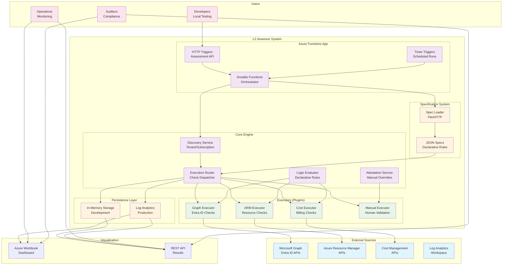

# LZ Assessor - Architecture Documentation

## System Overview

LZ Assessor is an automated Landing Zone assessment tool that evaluates Azure environments against best practices and compliance requirements using a declarative, API-driven approach.

## High-Level Architecture Diagram



## System Components

### 1. Azure Functions App (Entry Points)

**HTTP Triggers**
- `POST /api/assessment/run` - Simple assessment execution
- `POST /api/assessment/run-orchestrated` - Robust orchestrated execution
- `POST /api/orchestrator/run` - Enhanced orchestrator with design area filtering
- `GET /api/assessment/last` - Retrieve latest assessment results
- `GET /api/assessment/history` - Get assessment history

**Timer Triggers**
- Scheduled assessments for continuous monitoring
- Configurable intervals (daily, weekly, monthly)

**Durable Functions Orchestrator**
- Fault-tolerant execution coordination
- Parallel check execution with proper error handling
- State management for long-running assessments

### 2. Discovery Service

**Responsibilities:**
- Discover tenant information and metadata
- Enumerate available subscriptions
- Capture environment snapshot for assessment context
- Validate access permissions before execution

**Data Captured:**
```json
{
  "tenantId": "guid",
  "subscriptions": ["sub1", "sub2"],
  "metadata": {
    "capturedAt": "timestamp",
    "permissions": ["roles"],
    "regions": ["locations"]
  }
}
```

### 3. Execution Router

**Function:**
- Receives assessment requests with tenant/scope information
- Loads appropriate specifications based on design areas
- Dispatches individual checks to specialized executors
- Coordinates parallel execution and result aggregation

**Routing Logic:**
```
Request → Load Spec → Filter by Design Areas → Create Execution Plan → Execute Checks → Aggregate Results
```

### 4. Executors (Plugin Architecture)

#### Graph Executor
- **Purpose:** Microsoft Graph and Entra ID assessments
- **APIs Used:** Graph v1.0, Graph Beta, Entra ID
- **Check Types:** Domain verification, security policies, MFA, PIM, SSPR
- **Authentication:** Managed Identity + App Registration

#### ARM Executor  
- **Purpose:** Azure Resource Manager assessments
- **APIs Used:** Azure REST APIs, Resource Graph
- **Check Types:** Resource configurations, policies, locks, tagging
- **Authentication:** Managed Identity with appropriate RBAC

#### Cost Executor
- **Purpose:** Billing and cost management assessments  
- **APIs Used:** Cost Management APIs, Billing APIs
- **Check Types:** Budgets, cost exports, spending alerts, RBAC separation
- **Authentication:** Managed Identity with Cost Management Reader role

#### Manual Executor
- **Purpose:** Checks requiring human validation
- **Function:** Returns "ManualRequired" status for manual attestation
- **Integration:** Works with Attestation Service for overrides

### 5. Logic Evaluator

**Declarative Logic Engine** supporting:

```json
{
  "allOf": [ /* All conditions must be true */ ],
  "anyOf": [ /* At least one condition must be true */ ],
  "exists": { "path": "$.property" },
  "equals": { "path": "$.value", "value": "expected" },
  "gte": { "path": "$.count", "value": 1 },
  "lte": { "path": "$.limit", "value": 100 },
  "contains": { "path": "$.array", "value": "item" },
  "not": { /* Negation of condition */ }
}
```

**JSONPath Integration:**
- Uses JSONPath expressions for data navigation
- Supports complex filtering and aggregation
- Enables flexible rule definition without code changes

### 6. Attestation Service

**Manual Override System:**
- Allows human attestation for checks that cannot be automated
- Tracks attestor identity, evidence, and expiration
- Integrates with assessment results for compliance reporting

**Attestation Flow:**
1. Manual check identified during assessment
2. Attestation request generated with check details
3. Human reviewer provides evidence and status
4. Attestation stored with expiration tracking
5. Future assessments use valid attestations

### 7. Specification System

**JSON-Based Rule Definitions:**
- Declarative approach eliminates hardcoded rules
- Version-controlled specifications enable change tracking
- Support for multiple profiles (baseline, regulated, strict)

**Spec Structure:**
```json
{
  "specVersion": "2.0.0",
  "category": "Category Name",
  "profile": "baseline",
  "defaults": { /* Default settings */ },
  "checks": [ /* Individual check definitions */ ]
}
```

### 8. Persistence Layer

**Development Mode:**
- In-memory storage for local testing
- Fast iteration and debugging
- No external dependencies

**Production Mode:**
- Log Analytics workspace integration
- Structured logging with custom tables
- Query-able results for reporting and dashboards

## Data Flow Architecture

### 1. Assessment Request Flow

```
User Request → HTTP Trigger → Orchestrator → Discovery Service → Spec Loader → Execution Router
```

### 2. Check Execution Flow

```
Execution Router → Executor Selection → API Calls → Data Collection → Logic Evaluation → Result Generation
```

### 3. Result Processing Flow

```
Individual Results → Aggregation → Persistence → API Response / Dashboard Update
```

### 4. Attestation Flow

```
Manual Check → Attestation Request → Human Review → Evidence Submission → Override Application
```

## Security Architecture

### Authentication & Authorization

**Managed Identity (Primary):**
- Used for Azure API access (ARM, Cost Management)
- Role-based access control (Reader, Security Reader, Cost Management Reader)
- No credential management required

**App Registration (Secondary):**
- Required for Microsoft Graph API access
- API permissions: Directory.Read.All, Policy.Read.All, Reports.Read.All
- Certificate-based authentication recommended

### Data Security

**In Transit:**
- HTTPS for all API communications
- Certificate validation for external API calls
- Secure token handling for authentication

**At Rest:**
- Log Analytics workspace encryption
- Azure Key Vault integration for sensitive configuration
- No persistent storage of credentials

**Access Control:**
- Principle of least privilege for all service identities
- Regular access review and rotation of certificates
- Audit logging for all assessment activities

## Scalability & Performance

### Horizontal Scaling
- Azure Functions automatic scaling based on demand
- Stateless architecture enables unlimited horizontal scaling
- Durable Functions handle state management for reliability

### Parallel Execution
- Individual checks executed concurrently
- Executor-level parallelization for different data sources
- Optimized API call patterns to minimize latency

### Caching Strategy
- Discovery data cached per assessment run
- Spec files cached with version-based invalidation
- Result caching for repeated queries

## Monitoring & Observability

### Application Insights Integration
- Function execution metrics and logs
- Performance monitoring and alerting
- Error tracking and debugging information

### Custom Metrics
- Check execution times per executor
- Success/failure rates by check type
- Coverage metrics across design areas

### Log Analytics Queries
```kql
ALZ_Assessment_CL
| where TenantId_s == "tenant-id"
| summarize 
    TotalChecks = dcount(QuestionId_s),
    CompliantChecks = countif(Status_s == "Compliant"),
    NonCompliantChecks = countif(Status_s == "NonCompliant")
| extend ComplianceScore = round(todouble(CompliantChecks) / todouble(TotalChecks) * 100, 1)
```

## Extensibility Points

### New Executors
1. Implement `IExecutor` interface
2. Register in dependency injection container
3. Reference in specification files
4. No changes to core engine required

### New Check Types
1. Add to JSON specification
2. Define declarative logic rules
3. Configure evidence templates
4. Deploy updated spec file

### New Profiles
1. Create new specification with different thresholds
2. Configure via assessment request parameters
3. Support for baseline/regulated/strict variations

## Deployment Architecture

### Infrastructure Components
- Azure Function App (Consumption or Premium plan)
- Log Analytics Workspace for result persistence
- Application Insights for monitoring
- Azure Workbook for visualization

### Configuration Management
- Environment-specific settings in Function App configuration
- Spec URL configuration for different environments
- Feature flags for development/production modes

### CI/CD Integration
- Automated deployment via GitHub Actions
- Infrastructure as Code with ARM templates
- Automated testing in staging environments

This architecture provides a solid foundation for automated Landing Zone assessment with clear separation of concerns, extensibility, and production-ready monitoring and security features.